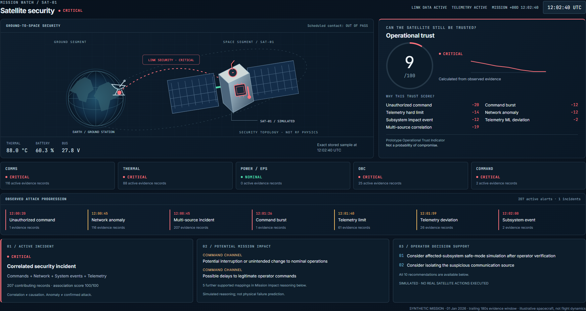
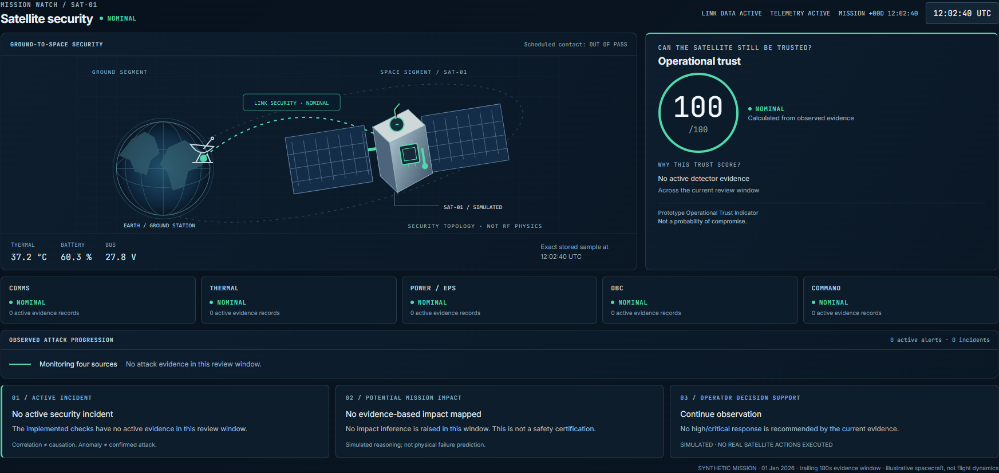
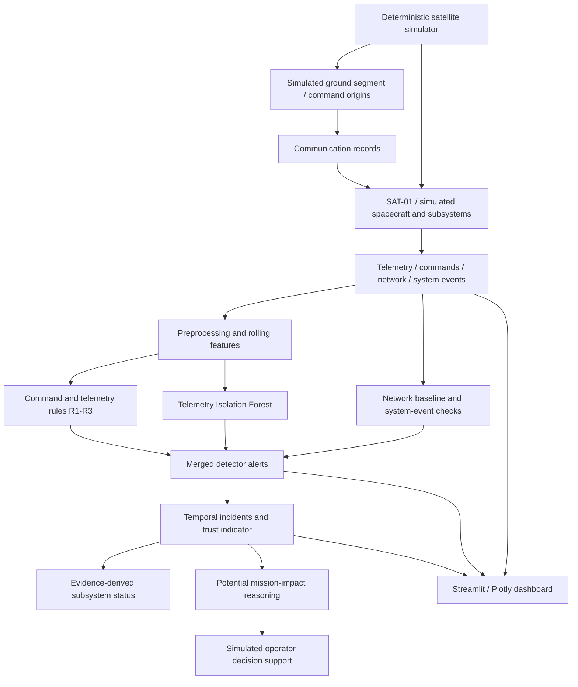

# TEKCLIPSE

## Satellite Cybersecurity & Operational Trust Demonstrator

### “Can the Satellite Still Be Trusted?”

[](https://github.com/JasserEzzine/TekClipse/actions/workflows/checks.yml)

**Python 3.14 · Streamlit · Plotly · ML: Isolation Forest · Simulation only**

TekClipse turns simulated satellite security evidence into an operational story: **what happened → where it happened → why trust changed → what could affect the mission → what an operator could consider**. Its mission-control Overview is designed for a space-oriented jury; all eight analyst/research tabs remain available.

The current dashboard and deployment code are on the [tekclipse-cloud branch](https://github.com/JasserEzzine/TekClipse/tree/tekclipse-cloud). Use that branch for the commands below; the default branch retains the earlier prototype.

TekClipse brings satellite telemetry, ground commands, network records and system events into one mission-control dashboard. It combines deterministic rules with an Isolation Forest baseline to explore deviations from nominal operation.

The project is an engineering/research prototype for **IASTAM 6.0, Track 5 — Cybersecurity, P9: “Can the Satellite Still Be Trusted?”** It uses generated data and does not connect to a real satellite.

> **An anomaly is not proof of an attack.** Every displayed measurement comes from the simulator or detector. The orbit is illustrative. No flight readiness, attack attribution or validated detection accuracy is claimed.



<details><summary>Compare with the actual E1 nominal screen</summary>



</details>

Screenshots are captured from the working app, not design mockups. [Media provenance and recording guidance](docs/assets/README.md) · [Mission-control implementation and validation](docs/mission-control.md).

## Phase A: scientific evaluation

The local Phase A package adds independent training/calibration/validation/test runs, explicit second/event/incident metrics, component comparisons, ablations and benign/attack robustness cases. It preserves the existing dashboard and trust formula. The calibrated IF profile is **opt-in for scientific evaluation**; it does not silently change the dashboard preview.

```powershell
python scripts/run_experiment.py --scientific --output results/phase-a
```

Read the [baseline audit](docs/phase-a/baseline.md), [evaluation protocol](docs/phase-a/protocol.md), [measured results and limitations](docs/phase-a/report.md), and [team handover](docs/phase-a/handover.md). These distinguish false-positive seconds from false-alarm episodes and attack-event coverage. The original E7 benchmark remains reproducible through the existing single-scenario CLI.

## Challenge and space context

A satellite's operational behavior depends on commands, communication, onboard processing, power and thermal conditions. An unusual reading alone does not explain whether an operator should trust the whole system. TekClipse brings those observations together and translates supported security evidence into clearly labeled **potential** mission consequences. The project has passed its research-paper selection stage; this repository presents the reproducible prototype for the next phase.

## What is implemented

- Four reproducible data streams, generated with seed **42**.
- Temperature/orbit cycles, sunlight/eclipse battery behavior, and correlated ground-pass activity.
- Concrete operational logs: contact acquisition, eclipse transitions, command acknowledgements and subsystem messages.
- Command and telemetry rules, plus nominal-trained telemetry Isolation Forest.
- Eight interactive dashboard tabs and seven runnable scenarios (E1–E7).
- Statistical network detection, explicit subsystem-event checks and multi-source incidents.
- An explainable 0–100 trust indicator, attack replay and simulated operator recommendations.
- Separate held-out, explicitly labeled synthetic evaluation for rules/ML/hybrid detection.
- A state-driven spacecraft/ground-link schematic, attack progression, mission-impact reasoning and one-click demo reset.
- Actual alert tables, charts and CSV exports; cached nominal results populate the first view.
- CSV, SQLite and optional Parquet storage. Generated outputs are excluded from this branch's Git tree.

Each source has a defined role: commands and telemetry feed the original rules, telemetry feeds Isolation Forest, network records feed a nominal statistical baseline, and explicit watchdog/degraded-subsystem events feed a small event check. Routine warnings/errors are not automatically classified as attacks.

## Data and architecture



In the diagram, the ground-to-space path is a **conceptual security topology**, not a hardware/RF simulator. The implementation generates stored records; it neither sends commands to spacecraft nor predicts physical failure.

## Ground-to-space security and mission impact

The hero schematic shows Earth, a ground station, the link and **SAT-01**, a display name for the simulated spacecraft. Its colors come from the existing Communications, Command channel, On-board computer, Power and Thermal statuses. “LINK DATA ACTIVE” means recent network records exist; the independently labeled scheduled contact may be **OUT OF PASS**. Telemetry values come from exact stored samples at or before the review time, never from display bins containing future E7 data.

The new mission-impact layer makes deterministic, traceable inferences from active evidence:

| Observed evidence | Security concern | Subsystem | Potential mission consequence |
|---|---|---|---|
| Unauthorized command | Command integrity at risk | Command channel | Possible interruption or unintended operational change |
| Command burst | Command availability at risk | Command channel | Possible delay to legitimate operator commands |
| Network anomaly | Communication integrity/availability at risk | Communications | Potential degradation of ground-to-space communication |
| Thermal or voltage limit | Operating margin at risk | Thermal / Power | Possible interruption to dependent subsystem or payload operations |
| Explicit watchdog/degraded event | Processing continuity / regulation concern | OBC / Thermal | Possible interruption of onboard processing or operating availability |
| ML telemetry deviation | Operational state needs verification | Telemetry | Possible deviation; cause and mission effect remain unconfirmed |

Each mapping retains contributing alert IDs and appears only when its evidence is active. It adds **no new detector, scoring adjustment or physical model**. Existing operator recommendations are presented unchanged.

**Mission impact represents simulated decision-support reasoning and does not predict physical spacecraft failure.** The attack chain is ordered by observed timestamps. E7 actually starts with its unauthorized command (+20s), then network activity (+45s); the presentation preserves that sequence.

| Source | Contents | Current use |
|---|---|---|
| Telemetry | Temperature, CPU, RAM, battery, voltage, power, signal strength | Charts, R3 physical limits, Isolation Forest |
| Commands | Timestamp, command type, source, authorization flag | Timeline, composition, R1/R2 checks |
| Network | Source/destination IP, protocol, packets, bytes, traffic rate, connection-count samples | Flow charts; per-second rate/spike and category-novelty detection |
| System events | Timestamp, event type, subsystem and message | Mission log, heatmap; explicit watchdog/degraded-subsystem checks |

Continuous telemetry and network records are sampled at **1 Hz**. The generator supports 1–720 hours. Seven days contain 604,800 records in each continuous stream; event and command counts follow generated activity. All IPs, commands and mission events are simulated. No generated command is sent to a device.

The generator models a 90-minute orbital cycle and recurring ground-station passes. These patterns provide experimental variety; they are not a validated orbital or spacecraft-physics model. A command acknowledgement records simulated dispatcher acceptance, not proof of execution.

## Detection behavior

| Layer | Behavior |
|---|---|
| R1 | Flags `UNKNOWN_1` or an explicit false authorization flag, including `GS_PRIMARY`. Missing authorization keeps the legacy default; this is not a complete production authorization policy. |
| R2 | Flags more than 10 commands in a one-minute bin. |
| R3 | Flags temperature above 85 °C or voltage outside 26–30 V. |
| Isolation Forest | Scores raw telemetry and its 60-sample rolling means/standard deviations against nominal training data. |
| NET | Sums packet/byte/rate records per second; limits are 1.5 × nominal 99.9th percentile. Also checks adjacent-second traffic rises and unseen source/destination/protocol categories. |
| SYS | Flags explicit `watchdog_reset` and `subsystem_degraded` events. Routine simulated authentication failures and checksum retries remain contextual logs. |

```python
n_estimators = 100
contamination = 0.05
random_state = 42
```

The dashboard uses `-decision_function` as its score and the existing nominal-training score quantile as its alert threshold. The score is **not an attack probability**. Nominal data can also produce IF alerts. Rule scores are fixed rule annotations, not calibrated probabilities.

Rules and model results are merged for display, including actual NET/SYS counts in the radar. Zero does not prove that a source is healthy. Isolation Forest is an established practical baseline, not an algorithmic novelty or a claimed optimum. ML explanations show the largest feature deviations from nominal means/standard deviations; these are context, not causal model attribution.

## Incidents and satellite trust

Correlation groups actionable evidence and subsequent alerts within a bounded **180-second** window (`security.correlation_window_seconds` in `config.yaml`). An incident requires at least two independent domains. R3 and ML both count as telemetry; repeated samples do not create independent corroboration. Incidents retain time ranges, contributing alert IDs, sources, severity and explanations. Association is temporal, not proof of causation.

The correlation score is `min(100, 20 × domains + 5 × non-ML detector families + 10 if critical evidence exists)`. Three or more domains and score ≥75 produce CRITICAL; other incidents are HIGH. This is an explainable association score, not a probability of an attack.

**Prototype Operational Trust Indicator:** begin at 100 and subtract capped penalties from evidence in the trailing review window. Caps are R1=20, R2=12, R3=18, NET=12, SYS=12 and ML=3. Multiply each by its maximum severity weight (WARNING=0.75, HIGH/CRITICAL=1), then round. Add a correlation deduction of 10 for HIGH or 19 for CRITICAL; floor the result at zero. Repeated samples do not multiply penalties.

Statuses: NORMAL ≥80; SUSPICIOUS 50–79; CRITICAL <50. The UI shows every deduction. This is a policy indicator, **not scientifically validated trust or attack probability**. Expired evidence can restore the score without proving remediation. The subsystem view maps evidence to Communications, Thermal, Power, On-board computer and Command channel; NORMAL means no mapped active evidence.

The briefing reviews a clearly labeled historical time near the injection. E7's replay reveals only evidence already observed at the selected time. R2's original minute-bin timestamp is preserved in raw alerts; correlation and evaluation use the 11th command's actual observation time.

**Recommended Operator Response** is display-only advice. The app never rejects real commands, isolates devices, or activates a real satellite safe mode.

## Dashboard

| Tab | What visitors can do |
|---|---|
| Overview | Trust/status briefing, subsystem flags, attack timeline, recommended responses, guided E7 replay, plus existing mission charts |
| Telemetry | Select signals, switch overlay/small multiples, inspect IF shading and correlation |
| Commands | Examine authorization, timelines, cumulative counts and command composition |
| Network | Inspect protocol traffic and animated aggregated flows |
| Events | Filter operational events and inspect the daily/hourly heatmap |
| Alerts | View severity/time/source summaries and export actual alerts |
| Scenarios E1–E7 | Run preserved E1–E6 and new E7; inspect incidents and run held-out evaluation |
| About | Read the architecture, scope and validation roadmap |

Chart aggregation limits browser payloads. Detection still uses the full selected telemetry resolution. Temperature bin maxima retain short thermal spikes; shaded display bins contain one or more IF flags. The live UTC clock is wall-clock time: the dataset itself is a stored simulation starting on **1 January 2026**.

## Scenarios

| ID | Implemented simulation | Expected detector coverage |
|---|---|---|
| E1 | Nominal operation | Baseline IF deviations may still occur |
| E2 | Unauthorized REBOOT command from `UNKNOWN_1` | R1 |
| E3 | Burst of 30 UPLOAD commands | R2 |
| E4 | Additional high-rate network records | NET statistical/novelty alerts |
| E5 | 120 °C temperature step for the injection window | R3; IF response can be inspected |
| E6 | Combined unauthorized command, network and temperature anomalies | R1/R3, telemetry IF, NET and correlation |
| E7 | Staged unauthorized configuration, unusual peer/traffic, command burst, thermal/CPU deviation, watchdog/degraded-subsystem events | R1/R2/R3, IF, NET, SYS, correlated incident and progressive trust deductions |

Existing injectors use **1 January 2026 at 12:00 UTC**. Dashboard model training always uses the untouched nominal dataset before injecting a scenario. The preview scores the full scenario timeline, which overlaps the nominal training timeline. Therefore, previews are **not held-out performance evaluations**.

## Evaluation: measurements with explicit labels

The Scenarios evaluation button and `python scripts/run_experiment.py --scenario E7 --hours 24` use `evaluation/validated.py`. They fit on the **first six hours of untouched nominal data**, then score the later timeline after scenario injection. Training and test samples do not overlap; test rolling features restart at the split. The generator's explicit injected intervals supply labels. Missing labels, incomplete 1 Hz coverage or an injection outside the held-out range make the run unavailable.

Precision, recall, F1 and false-positive rate use one-second bins: a positive prediction means at least one detector alert in that second. Detection rate is the fraction of injected intervals with an alert. Latency averages the first in-window alert delay across detected intervals only; missed intervals are counted separately. Undefined values are blank/null, never invented zeros. Feature aftereffects outside injection windows count as false positives.

The comparison is **R1–R3 only / telemetry IF only / hybrid (rules + IF + NET + SYS)**. Detector coverage differs, so this is an operational comparison, not a controlled ablation. Temporal hits do not establish correct causal attribution. E7's extended network interval includes its later stages; interval detection rate does not mean every stage was detected. Synthetic results do not establish real satellite accuracy. Correlation/trust are not classifiers in this benchmark.

The legacy evaluator remains callable for compatibility, but now marks its onset-only performance metrics unavailable (`NaN`) instead of presenting invalid counts. The Phase A scientific package separately measures batch runtime and sampled process memory; real-world validation remains future work.

## Demonstrate E7 in 2–3 minutes

1. Start the app with `python -m streamlit run streamlit_app.py`. Keep the one-day range for the fastest demo; warm up E7 once before presenting.
2. **0:00–0:30:** Overview → **Start nominal E1**. Point to SAT-01, link data, subsystem status and the calculated trust indicator. Explain that this is synthetic data and nominal IF flags can still occur.
3. **0:30–1:30:** click **Launch E7 attack**, then **Next attack stage**. The same screen changes as the unauthorized command (+20s), network (+45s), burst (+86s), thermal deviation (+100s) and impact event (+120s) are observed.
4. **1:30–2:15:** show the CRITICAL incident, actual trust deductions and colored spacecraft/subsystems. Open **Mission impact reasoning** to connect the cyber evidence to a potential operational consequence.
5. **2:15–3:00:** show **Operator Decision Support** and its simulation disclaimer. Expand **Analyst briefing** for full recommendations, timelines, formulas and evidence export. Finish with **Reset demo**, then **Start nominal E1**, demonstrating that no stale E7 state remains.

The slider can revisit any point without future evidence leaking into the briefing. **Run E7** in Scenarios also opens a completed incident review. E7 needs at least 13 hours of data; dashboard ranges satisfy this. Evaluation is optional and can be run before the presentation.

The original **Judge demo** helper, mission activity, animated orbital schematic and ML gauge remain below the main briefing. Analyst charts intentionally retain the full scenario timeline; only the hero replay is restricted to already-observed evidence. Original and new Streamlit controls reuse cached detector output. Advancing stages does not retrain Isolation Forest.

## Run locally

Use **Python 3.14**, the version used for this deployment branch's checks.

```bash
git clone --branch tekclipse-cloud https://github.com/JasserEzzine/TekClipse.git
cd TekClipse
python -m venv .venv
# Windows PowerShell: .venv\Scripts\Activate.ps1
# Linux/macOS: source .venv/bin/activate
python -m pip install -r requirements.txt
python -m streamlit run streamlit_app.py
```

The cloud entrypoint prepares a seven-day dataset once, computes an actual one-day nominal preview, and opens the full dashboard. The initial view is one day; hosted visitors can choose one or seven days to bound resource use.

For the local interface with ranges up to 30 days:

```bash
python scripts/prepare_demo.py --hours 168
python -m streamlit run tekclipse/dashboard/app.py
```

Optional generation commands:

```bash
python scripts/generate_data.py --hours 168
python scripts/generate_data.py --hours 720 --output-dir ./long-run-data
```

A run may take time while generating data or fitting the model. Cached results make repeated views faster. Results are deterministic for a fixed generator/configuration; changing duration or implementation can change generated activity.

## Deploy the full app

1. Sign in at [Streamlit Community Cloud](https://share.streamlit.io/) using the GitHub account with access to this repository.
2. Create an app with these settings:

   | Setting | Value |
   |---|---|
   | Repository | `JasserEzzine/TekClipse` |
   | Branch | `tekclipse-cloud` |
   | Main file | `streamlit_app.py` |
   | Python version, under Advanced settings | `3.14` |

3. Leave application secrets empty: **TekClipse requires no API key**.
4. Deploy, wait for initialization, and share the resulting `https://…streamlit.app` URL.
5. Choose public or restricted viewer access in the hosting platform's sharing settings.

See the [official deployment instructions](https://docs.streamlit.io/deploy/streamlit-community-cloud/deploy-your-app/deploy). The hosting service runs independently of your computer. Free hosting may sleep while idle and is subject to provider resource limits; cold startup is not instant. Temporary host storage can be lost, after which the app regenerates its simulation.

## Security and data handling

- No external API calls, cloud credentials or satellite credentials are required by the dashboard.
- No user file uploads, arbitrary command execution or user-selected filesystem paths are exposed in the UI.
- The displayed dataset is synthetic. Anyone with viewer access can inspect it, run the supported scenarios and export its alerts.
- HTML ticker text is escaped. Decorative JavaScript is bundled application code, not visitor-provided input.
- CORS and XSRF protections stay enabled; arbitrary static-directory serving is disabled. Browser stack traces are hidden while diagnostics remain available in server logs.
- Preview writes are atomic. Uncached detector jobs run one at a time per server process to reduce simultaneous model-training memory use.
- Shared cached data/results are appropriate only for this public synthetic demo. Do not add private mission data without implementing and reviewing access controls and session isolation.
- Credential files, environment files, generated results and local logs are ignored by Git. Never commit a real secret; if one is exposed, revoke it rather than merely deleting the file.

See [SECURITY.md](SECURITY.md) for audit scope, reporting guidance and residual limits. A clean scan is not a guarantee against all vulnerabilities or operational failures.

## Repository map

```text
streamlit_app.py           Cloud startup and full dashboard entrypoint
.streamlit/config.toml    Theme and public-host protections
config.yaml               Simulation/model configuration
requirements.txt          Pinned Python dependencies
tekclipse/data/            Generator, preserved E1–E6 and coordinated E7
tekclipse/pipeline/        Original detectors plus network/correlation/trust/response
tekclipse/dashboard/      UI, Plotly charts, caching and preview persistence
tekclipse/evaluation/     Explicit held-out evaluation and legacy compatibility API
tekclipse/storage/        CSV/SQLite/JSON result helpers
scripts/                  Generation and preparation utilities
tests/                    Data, scenario, hosting and regression checks
```

## Validation and next work

```bash
python -m pytest -q
```

The tests cover reproducibility, storage round trips, command acknowledgement alignment, scenario/rule compatibility, preview freshness, concurrent preview writes and detector serialization. Deployment checks also exercise startup, all tabs and actual scenario buttons.

Tests also check E4 network coverage, E7 reproducibility/non-mutation, time-bounded correlation, deterministic trust deductions, observation-time causality, subsystem mapping, known confusion matrices, held-out coverage and the actual guided replay/evaluation controls. See [the upgrade implementation notes](docs/security-upgrade.md) for the changed files and test scope.

Mission-control tests additionally cover impact provenance, ground/link availability, causal attack ordering, valid SVG assets, exact displayed trust, all E7 replay steps and reset without model retraining. Optional real-browser verification uses an installed Edge browser:

```bash
python -m pip install playwright  # Developer verification tool; not an app dependency
python scripts/check_mission_ui.py --url http://127.0.0.1:8503
```

Start Streamlit on that port first, or pass its actual URL. This checks all tabs and both 1920×1080 and 1366×768 layouts and records actual screenshots and transition timings.

Phase A adds independent-run calibration, controlled ablations and batch runtime/process-memory measurements. The remaining research roadmap is to validate more diverse missions and measure deployment-specific CPU and memory overhead. Negative and inconclusive outcomes should be reported alongside successful cases. The current network detector uses a fixed nominal envelope and can flag legitimate new peers/protocols; correlation uses time proximity, not authenticated identity or a causal graph.

Fonts are bundled under `tekclipse/dashboard/assets/` with their SIL Open Font License texts. This is a simulation-based feasibility investigation, not a production satellite cybersecurity system.
