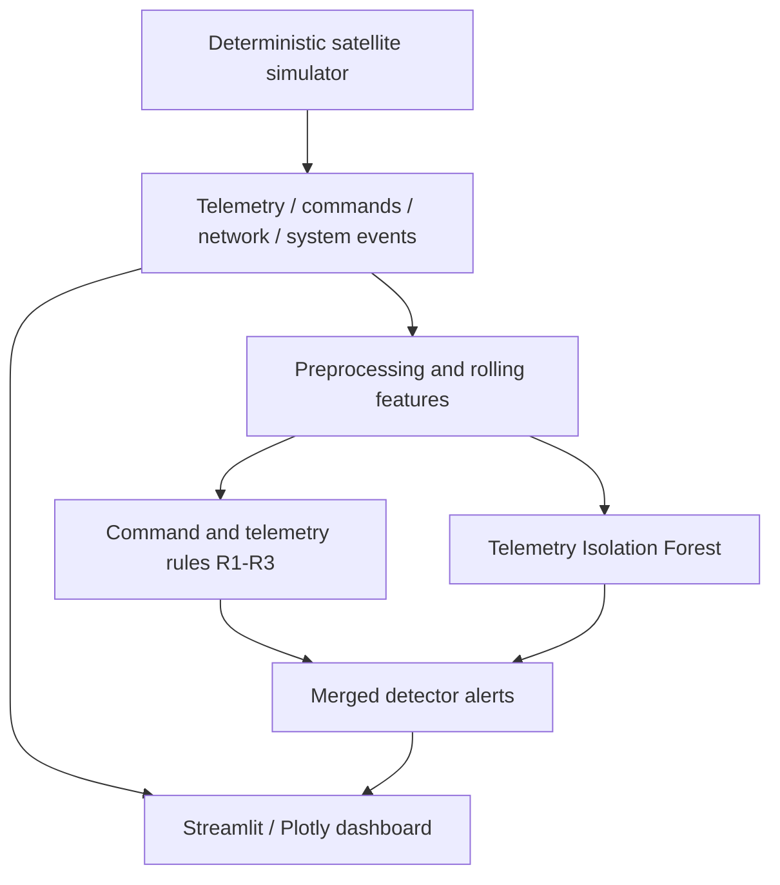

# TekClipse

**A lightweight anomaly-detection demonstrator for simulated satellite operations.**

The current dashboard and deployment code are on the [tekclipse-cloud branch](https://github.com/JasserEzzine/TekClipse/tree/tekclipse-cloud). Use that branch for the commands below; the default branch retains the earlier prototype.

TekClipse brings satellite telemetry, ground commands, network records and system events into one mission-control dashboard. It combines deterministic rules with an Isolation Forest baseline to explore deviations from nominal operation.

The project is an engineering/research prototype for **IASTAM 6.0, Track 5 — Cybersecurity, P9: “Can the Satellite Still Be Trusted?”** It uses generated data and does not connect to a real satellite.

> **An anomaly is not proof of an attack.** Every displayed measurement comes from the simulator or detector. The orbit is illustrative. No flight readiness, attack attribution or validated detection accuracy is claimed.

## What is implemented

- Four reproducible data streams, generated with seed **42**.
- Temperature/orbit cycles, sunlight/eclipse battery behavior, and correlated ground-pass activity.
- Concrete operational logs: contact acquisition, eclipse transitions, command acknowledgements and subsystem messages.
- Command and telemetry rules, plus nominal-trained telemetry Isolation Forest.
- Eight interactive dashboard tabs and six runnable injected scenarios.
- Actual alert tables, charts and CSV exports; cached nominal results populate the first view.
- CSV, SQLite and optional Parquet storage. Generated outputs are excluded from this branch's Git tree.

**Monitoring four sources does not mean four independent detectors are implemented.** Network and event records are visualized; the current detection rules/model primarily inspect commands and telemetry.

## Data and architecture



| Source | Contents | Current use |
|---|---|---|
| Telemetry | Temperature, CPU, RAM, battery, voltage, power, signal strength | Charts, R3 physical limits, Isolation Forest |
| Commands | Timestamp, command type, source, authorization flag | Timeline, composition, R1/R2 checks |
| Network | Source/destination IP, protocol, packets, bytes, traffic rate, connection-count samples | Flow charts and scenario visualization |
| System events | Timestamp, event type, subsystem and message | Mission log, activity counts, heatmap |

Continuous telemetry and network records are sampled at **1 Hz**. The generator supports 1–720 hours. Seven days contain 604,800 records in each continuous stream; event and command counts follow generated activity. All IPs, commands and mission events are simulated. No generated command is sent to a device.

The generator models a 90-minute orbital cycle and recurring ground-station passes. These patterns provide experimental variety; they are not a validated orbital or spacecraft-physics model. A command acknowledgement records simulated dispatcher acceptance, not proof of execution.

## Detection behavior

| Layer | Behavior |
|---|---|
| R1 | Simplified command-source/authorization check; detects the demonstrated `UNKNOWN_1` source. It is not a complete production authorization policy. |
| R2 | Flags more than 10 commands in a one-minute bin. |
| R3 | Flags temperature above 85 °C or voltage outside 26–30 V. |
| Isolation Forest | Scores raw telemetry and its 60-sample rolling means/standard deviations against nominal training data. |

```python
n_estimators = 100
contamination = 0.05
random_state = 42
```

The dashboard uses `-decision_function` as its score and the existing nominal-training score quantile as its alert threshold. The score is **not an attack probability**. Nominal data can also produce IF alerts. Rule scores are fixed rule annotations, not calibrated probabilities.

Rules and model results are merged for display. “Network” and “Events” radar values reflect the absence of corresponding detector alerts; zero does not prove that these sources are healthy. Isolation Forest is an established practical baseline, not an algorithmic novelty or a claimed optimum.

## Dashboard

| Tab | What visitors can do |
|---|---|
| Overview | Inspect current samples, actual alerts, nominal score, mission activity and the orbit schematic |
| Telemetry | Select signals, switch overlay/small multiples, inspect IF shading and correlation |
| Commands | Examine authorization, timelines, cumulative counts and command composition |
| Network | Inspect protocol traffic and animated aggregated flows |
| Events | Filter operational events and inspect the daily/hourly heatmap |
| Alerts | View severity/time/source summaries and export actual alerts |
| Scenarios E1–E6 | Run the existing injectors and detector previews |
| About | Read the architecture, scope and validation roadmap |

Chart aggregation limits browser payloads. Detection still uses the full selected telemetry resolution. Temperature bin maxima retain short thermal spikes; shaded display bins contain one or more IF flags. The live UTC clock is wall-clock time: the dataset itself is a stored simulation starting on **1 January 2026**.

## Scenarios

| ID | Implemented simulation | Expected detector coverage |
|---|---|---|
| E1 | Nominal operation | Baseline IF deviations may still occur |
| E2 | Unauthorized REBOOT command from `UNKNOWN_1` | R1 |
| E3 | Burst of 30 UPLOAD commands | R2 |
| E4 | Additional high-rate network records | Visualized; no network detector is implemented |
| E5 | 120 °C temperature step for the injection window | R3; IF response can be inspected |
| E6 | Combined unauthorized command, network and temperature anomalies | R1/R3 and telemetry IF; network remains unscored |

Existing injectors use **1 January 2026 at 12:00 UTC**. Dashboard model training always uses the untouched nominal dataset before injecting a scenario. The preview scores the full scenario timeline, which overlaps the nominal training timeline. Therefore, previews are **not held-out performance evaluations**.

The separate evaluation module is experimental. Timestamp handling is regression-tested, but its onset-based event matching, train/test alignment and CPU/RAM accounting still require methodological validation. Its outputs must not be presented as established detection rate, FPR, latency or monitoring overhead. The public dashboard does not present those values as validated results.

## Run locally

Use **Python 3.14**, the version used for this deployment branch's checks.

```bash
git clone --branch tekclipse-cloud https://github.com/JasserEzzine/TekClipse.git
cd TekClipse
python -m venv .venv
# Windows PowerShell: .venv\Scripts\Activate.ps1
# Linux/macOS: source .venv/bin/activate
python -m pip install -r requirements.txt
python -m streamlit run streamlit_app.py
```

The cloud entrypoint prepares a seven-day dataset once, computes an actual one-day nominal preview, and opens the full dashboard. The initial view is one day; hosted visitors can choose one or seven days to bound resource use.

For the local interface with ranges up to 30 days:

```bash
python scripts/prepare_demo.py --hours 168
python -m streamlit run tekclipse/dashboard/app.py
```

Optional generation commands:

```bash
python scripts/generate_data.py --hours 168
python scripts/generate_data.py --hours 720 --output-dir ./long-run-data
```

A run may take time while generating data or fitting the model. Cached results make repeated views faster. Results are deterministic for a fixed generator/configuration; changing duration or implementation can change generated activity.

## Deploy the full app

1. Sign in at [Streamlit Community Cloud](https://share.streamlit.io/) using the GitHub account with access to this repository.
2. Create an app with these settings:

   | Setting | Value |
   |---|---|
   | Repository | `JasserEzzine/TekClipse` |
   | Branch | `tekclipse-cloud` |
   | Main file | `streamlit_app.py` |
   | Python version, under Advanced settings | `3.14` |

3. Leave application secrets empty: **TekClipse requires no API key**.
4. Deploy, wait for initialization, and share the resulting `https://…streamlit.app` URL.
5. Choose public or restricted viewer access in the hosting platform's sharing settings.

See the [official deployment instructions](https://docs.streamlit.io/deploy/streamlit-community-cloud/deploy-your-app/deploy). The hosting service runs independently of your computer. Free hosting may sleep while idle and is subject to provider resource limits; cold startup is not instant. Temporary host storage can be lost, after which the app regenerates its simulation.

## Security and data handling

- No external API calls, cloud credentials or satellite credentials are required by the dashboard.
- No user file uploads, arbitrary command execution or user-selected filesystem paths are exposed in the UI.
- The displayed dataset is synthetic. Anyone with viewer access can inspect it, run the supported scenarios and export its alerts.
- HTML ticker text is escaped. Decorative JavaScript is bundled application code, not visitor-provided input.
- CORS and XSRF protections stay enabled; arbitrary static-directory serving is disabled. Browser stack traces are hidden while diagnostics remain available in server logs.
- Preview writes are atomic. Uncached detector jobs run one at a time per server process to reduce simultaneous model-training memory use.
- Shared cached data/results are appropriate only for this public synthetic demo. Do not add private mission data without implementing and reviewing access controls and session isolation.
- Credential files, environment files, generated results and local logs are ignored by Git. Never commit a real secret; if one is exposed, revoke it rather than merely deleting the file.

See [SECURITY.md](SECURITY.md) for audit scope, reporting guidance and residual limits. A clean scan is not a guarantee against all vulnerabilities or operational failures.

## Repository map

```text
streamlit_app.py           Cloud startup and full dashboard entrypoint
.streamlit/config.toml    Theme and public-host protections
config.yaml               Simulation/model configuration
requirements.txt          Pinned Python dependencies
tekclipse/data/            Generator and E1–E6 injectors
tekclipse/pipeline/        Features, rules and Isolation Forest
tekclipse/dashboard/      UI, Plotly charts, caching and preview persistence
tekclipse/evaluation/     Experimental evaluator and metric helpers
tekclipse/storage/        CSV/SQLite/JSON result helpers
scripts/                  Generation and preparation utilities
tests/                    Data, scenario, hosting and regression checks
```

## Validation and next work

```bash
python -m pytest -q
```

The tests cover reproducibility, storage round trips, command acknowledgement alignment, scenario/rule compatibility, preview freshness, concurrent preview writes and detector serialization. Deployment checks also exercise startup, all tabs and actual scenario buttons.

The research roadmap is to validate strictly held-out injection windows and ground truth; measure detection rate, false positives and latency; distinguish process usage from incremental monitoring overhead; and compare telemetry-only monitoring with genuinely multi-source detection. Negative and inconclusive outcomes should be reported alongside successful cases.

Fonts are bundled under `tekclipse/dashboard/assets/` with their SIL Open Font License texts. This is a simulation-based feasibility investigation, not a production satellite cybersecurity system.
